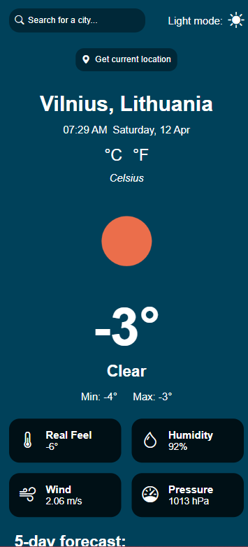

# Weather app

A simple, elegant weather application that provides real-time weather data for any location. Features dark/light mode, unit conversion (°F/°C), and detailed weather metrics.

### Features

- Current Weather: Temperature, real feel, humidity, wind speed, pressure.
- Forecast: Multi-day weather predictions.
- Location-Based: Auto-detects your current location or search anywhere.
- Dark/Light Mode: Toggle between themes for better readability.
- Unit Conversion: Switch between Celsius (°C) and Fahrenheit (°F).

### Links

- Code URL: (https://github.com/agneja00/WeatherApp)
- Live Site URL: (https://weather-app-rho-blond.vercel.app/)

### Built with

- Frontend: HTML, CSS, JavaScript;
- API: OpenWeatherMap;
- Icons: Bootstrap;
- Design: Responsive & mobile-friendly;
- Vercel: deployment platform for fast, global hosting and automatic CI/CD integration.

## Author

- Website - [Agnieska Jackevic] (https://web-portfolio-agneja00.vercel.app/)
- Linkedin - [Agnieska Jackevic] (https://www.linkedin.com/in/agnieska-jackevic-948830222/)

